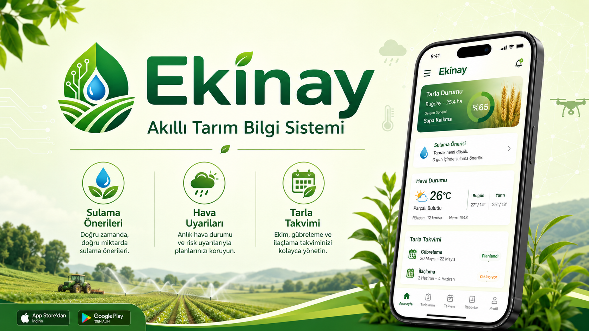

# EKİNAY

## Proje Hakkında

**Proje Tanımı:** 
Ekinay, tarımsal üretim yapan kullanıcıların ekim sürecinden hasat dönemine kadar olan faaliyetlerini daha planlı ve bilinçli şekilde yürütebilmelerini amaçlayan bir tarım destek uygulamasıdır. Uygulama, kullanıcıların tarla konumu, ekilen ürün türü ve ekim tarihi gibi temel bilgileri sisteme girmesine olanak tanır. Girilen bu bilgiler, internet üzerinden alınan hava durumu ve çevresel verilerle birlikte değerlendirilerek kullanıcıya yol gösterici bilgiler sunar.

Sistem, tarım faaliyetlerini etkileyen hava koşullarını düzenli olarak takip eder ve olası risk durumlarında kullanıcıyı bilgilendirir. Don, fırtına ve benzeri olumsuz hava olayları beklenmesi durumunda uygulama uyarı mekanizması aracılığıyla çiftçinin zamanında önlem almasını sağlar. Bunun yanında, ekilen ürüne ve bulunduğu bölgenin iklim özelliklerine bağlı olarak sulama zamanları ve tahmini hasat dönemi hakkında bilgilendirme yapılır.

Ekinay, özellikle küçük ve orta ölçekli üreticilerin tarımsal bilgiye daha kolay erişmesini hedefler. Uygulama, karmaşık teknik terimler kullanmadan, kullanıcıların anlayabileceği sade bir dil ile öneriler sunar. Bu sayede çiftçiler, dış kaynaklara ihtiyaç duymadan kendi üretim süreçlerini daha verimli şekilde yönetebilir ve çevresel koşullara daha hızlı uyum sağlayabilir.

**Proje Kategorisi: Tarım** 

---

## Proje Linkleri

- **REST API Adresi:**
https://ekinay-smart-agriculture-system.onrender.com
- **Web Frontend Adresi:** 
https://ekinay-smart-agriculture-system.vercel.app

---

## Proje Ekibi

**Grup Adı:TENGYAMİ** 

**Ekip Üyeleri:** 

- Ali Sarısu

---

## Dokümantasyon

Proje dokümantasyonuna aşağıdaki linklerden erişebilirsiniz:

1. [Gereksinim Analizi](Gereksinim-Analizi.md)
2. [REST API Tasarımı](API-Tasarimi.md)
3. [REST API](Rest-API.md)
4. [Web Front-End](WebFrontEnd.md)
5. [Mobil Front-End](MobilFrontEnd.md)
6. [Mobil Backend](MobilBackEnd.md)
7. [Video Sunum](Sunum.md)

